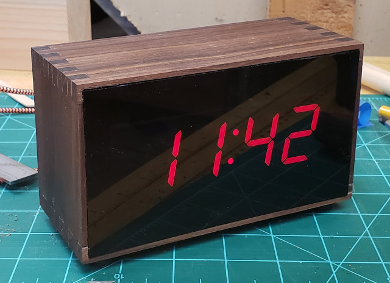
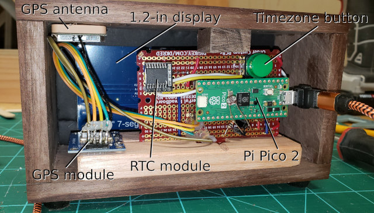

## GPS Clock

A Raspberry Pi **Pico** implementation in MicroPython of a simple digital
clock that requires no network and *never* needs setting.

### Features

#### Zero-touch

* Automatic time.  The clock gets its time from a GPS module and
optionally uses a battery-backed real-time clock for when the GPS fix
is lost or while waiting for a GPS fix at startup.
* Automatic Daylight Savings Time (DST) setting. Transitions for several
timezones are read from \*nix zoneinfo files.
* Automatic display dimming based on ambient light level.

#### Support for different displays

* As it stands it can use *either* the ubiquitous 0.56-inch TM1637-driven
4-digit 7-segment display *or* a 1.2-inch display with an HT16K33 backpack
from Adafruit.
* Other types of displays could be easily incorporated with Python modules
that mimic initialization and the few class methods used in ```main.py```.

### Hardware used

* Raspberry Pi Pico 2 (or original Pico) [*DigiKey*](https://www.digikey.com/en/products/detail/raspberry-pi/SC1632/26241102)
* Neo-6M GPS module [*Amazon*](https://www.amazon.com/HiLetgo-GY-NEO6MV2-Controller-Ceramic-Antenna/dp/B01D1D0F5M)
* TM1637 4-digit 7-segment display (typically 0.56-inch tall) [*Amazon*](https://www.amazon.com/DAOKI-Display-Segment-Digital-Arduino/dp/B0821451V7)
* *or* HT16K33-driven 4-digit 7-segment 1.2-inch display [*DigiKey*](https://www.digikey.com/en/products/detail/adafruit-industries-llc/1270/6618727)
* DS3231 battery-backed real-time clock (RTC) *optional* [*Jameco*](https://www.jameco.com/z/DS3231-Jameco-ValuePro-DS3231-Real-Time-Clock-Module-Breakout-Board_2217625.html)
* GM5539 photo resistor or similiar (also called a photodetector, photocell, CdS or photoconductive cell) *optional* [*Amazon*](https://www.amazon.com/BOJACK-Photoresistance-Sensitive-Resistor-GM5539/dp/B08BKRPBVL)
* 10K Ohm resistor
* Momentary contact button
* Circuit board of choice. (One that mimics a breadboard make it easy: [*DigiKey*](https://www.digikey.com/en/products/detail/digikey/DKS-SOLDERBREAD-02/15970925))

Most of these are available on Amazon, too, and some direct from AdaFruit.

### Implementation details

#### Third-party code

These external modules are used (some modified from original) in addition
to the software unique to this project:

* Interface to the GPS module: [microGPS](https://github.com/inmcm/micropyGPS/)
* Interface to the TM1637-driven display: [MicroPython TM1637](https://github.com/mcauser/micropython-tm1637) *locally modified*
* Interface to the HT16K33-driven display: [MultiWingSpan HT16K33](http://multiwingspan.co.uk/pico.php?page=ht16k33) *locally modified*
* Interface to the DS3231 RTC: [micropython-tm1637](https://github.com/mcauser/micropython-tm1637) *locally modified*

#### Project code

Developed specifically for this project, mostly by hand, some with the
assistance of AI (see *AI Disclosure* below):


* ```epoch.py```: Conversion of a calendar date and time to Unix Epoch seconds
* ```event_timer.py```: Simple polled event timer class
* ```lightsensor.py```: Interface to a photo resistor to get a brightness value for the display
* ```main.py```: Launched automatically by MicroPython at boot, contains setup and main logic loop.
* ```mytz.py```: Methods for using the timezones
* ```tzoneinfo.py```: An object to read and interface with the data in a zoneinfo timezone file

#### Timezone and Daylight Savings Time (DST) handling

A (*possibly* unique?) feature of this project is that the clock
*automatically* adjusts for Daylight Savings Time. For this the Unix
*zoneinfo* files for 7 US timezones are available in the ```zoneinfo```
subdirectory (though Arizona doesn't seems to load). If you live somewhere
else, including a county that has its own rules, upload the right file
from Linux and edit ```mytz.py```.

At the moment the data runs through the year 2037. (We all know what
happens at 3:14:08 UTC on January 19, 2038, right?)  The binary zoneinfo files should be able to
handle 64-bit times in the Unix epoch past 2038. I have not yet looked
into whether they just haven't been updated yet (that's still 12 years
away as of this writing), or if the decoder code didn't handle that
part right.

The code in ```main.py``` supports changing timezones with a button --
the sole button on the clock. It cycles between the 6 standard zones
(Eastern, Central, Mountain, Pacific, Alaskan, Hawaii/Aluetian) plus
Arizona which does not observe DST. The currently selected zone is saved
in the onboard file ```defaultzone``` and becomes the default when the
device restarts. You can pre-populate this if you want; it must match
the file name in ```zoneinfo``` exactly without the path.

#### To do

* Double check that ```tzoneinfo.py``` and ```mytz.py``` handle 64-bit
extended zone files correctly
for dates 2038 and beyond
* Indicate when the GPS fix has been lost somehow?
* Make a Fritzing schematic of the circuit. Meanwhile the connections
are given in **gpsclock-wiring.ods** and are pretty simple. (Also see
the setup section in ```main.py```) **NOTE: The .ods file is out of date
and incorrect.** This note will be removed when it's been updated.
* Move configuration to a separate file for easier customization
* *Et cetera*

#### AI disclosure

* Gemini was used to rewrite ```epoch.py``` when the values returned by
```UnixEpoch.to_epoch_seconds()``` was always off by a handful of
seconds. It turned out that an AI assist wasn't really necessary -- the
code I wrote was correct *except* for an instance of float poisoning that
caused a loss of precision in the 32-bit floating-point implementation
in MicroPython. (The seconds value was being passed as a float.) It
works fine when sticking to long integers.
* Gemini was used to generate the code in ```tzoneinfo.py``` that reads the
binary zoneinfo files.
* Grok was used to add ```set_colon()``` and ```toggle_colon()```
methods to ```tm1637.py```.

### Enclosure

How to construct an enclosure for your clock is beyond the scope
of this document.  The possibilities are endless, but for what it's
worth, either of the LED displays noted above works well behind a black
transparent acrylic faceplate.  I made mine using [this product from
Amazon](https://www.amazon.com/dp/B0DD6R4N3R). It proved easy to cut
to size by scoring it several times with a utility knife and carefully
striking the edge; find instructional videos on YouTube for how to cut
acrylic or plexiglass sheets. Use proper personal protective gear such
as eye protection and work gloves.




